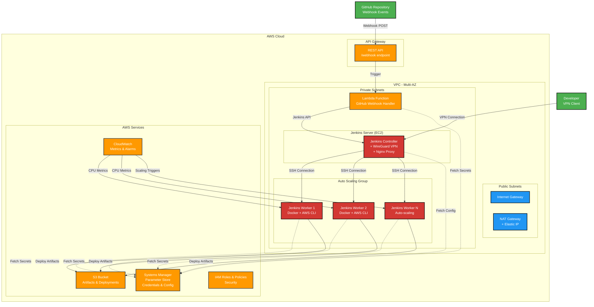

```mermaid
graph TB
    %% External
    GitHub[GitHub Repository<br/>Webhook Events]
    Developer[Developer<br/>VPN Client]
    
    %% AWS Services
    subgraph "AWS Cloud"
        subgraph "API Gateway"
            APIGW[REST API<br/>/webhook endpoint]
        end
        
        subgraph "VPC - Multi-AZ"
            subgraph "Public Subnets"
                IGW[Internet Gateway]
                NAT[NAT Gateway<br/>+ Elastic IP]
            end
            
            subgraph "Private Subnets"
                subgraph "Jenkins Server (EC2)"
                    JS[Jenkins Controller<br/>+ WireGuard VPN<br/>+ Nginx Proxy]
                end
                
                subgraph "Auto Scaling Group"
                    JW1[Jenkins Worker 1<br/>Docker + AWS CLI]
                    JW2[Jenkins Worker 2<br/>Docker + AWS CLI]
                    JWN[Jenkins Worker N<br/>Auto-scaling]
                end
                
                Lambda[Lambda Function<br/>GitHub Webhook Handler]
            end
        end
        
        subgraph "AWS Services"
            S3[S3 Bucket<br/>Artifacts & Deployments]
            SSM[Systems Manager<br/>Parameter Store<br/>Credentials & Config]
            CW[CloudWatch<br/>Metrics & Alarms]
            IAM[IAM Roles & Policies<br/>Security]
        end
    end
    
    %% Connections
    GitHub -->|Webhook POST| APIGW
    APIGW -->|Trigger| Lambda
    Lambda -->|Jenkins API| JS
    Lambda -.->|Fetch Secrets| SSM
    
    Developer -->|VPN Connection| JS
    JS -->|SSH Connection| JW1
    JS -->|SSH Connection| JW2
    JS -->|SSH Connection| JWN
    
    JS -.->|Fetch Config| SSM
    JW1 -.->|Fetch Secrets| SSM
    JW2 -.->|Fetch Secrets| SSM
    JWN -.->|Fetch Secrets| SSM
    
    JW1 -->|Deploy Artifacts| S3
    JW2 -->|Deploy Artifacts| S3
    JWN -->|Deploy Artifacts| S3
    
    CW -->|CPU Metrics| JW1
    CW -->|CPU Metrics| JW2
    CW -->|Scaling Triggers| JWN
    
    %% Styling
    classDef aws fill:#FF9900,stroke:#232F3E,stroke-width:2px,color:#fff
    classDef jenkins fill:#D33833,stroke:#000,stroke-width:2px,color:#fff
    classDef external fill:#4CAF50,stroke:#000,stroke-width:2px,color:#fff
    classDef network fill:#2196F3,stroke:#000,stroke-width:2px,color:#fff
    
    class S3,SSM,CW,IAM,APIGW,Lambda aws
    class JS,JW1,JW2,JWN jenkins
    class GitHub,Developer external
    class IGW,NAT network
```