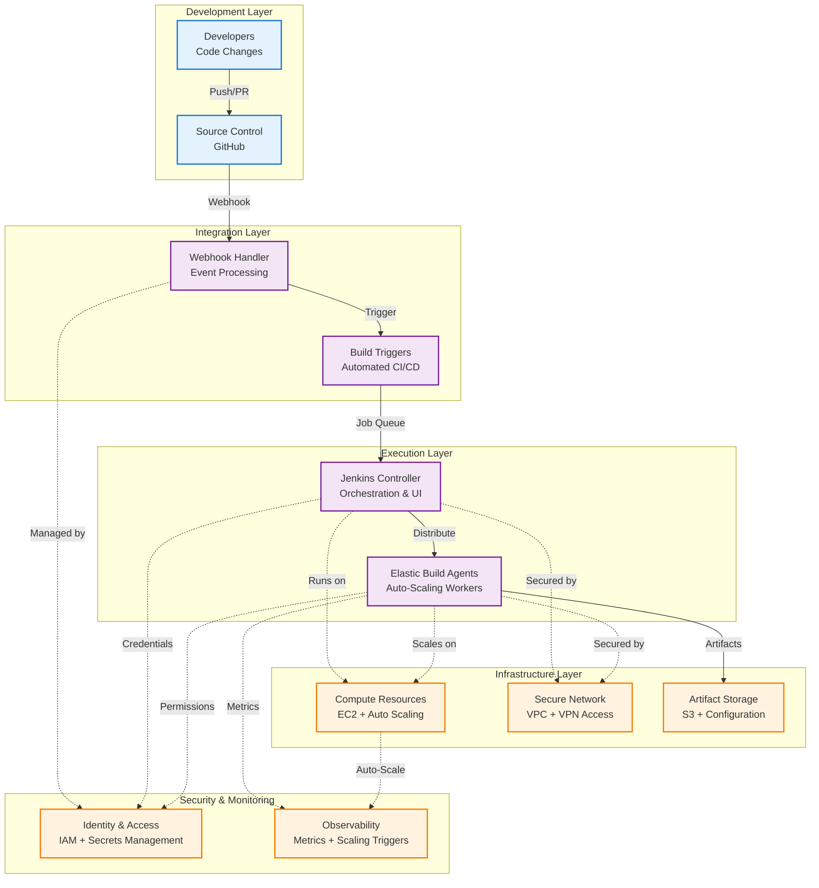

# HA Jenkins - High-Level Architecture

## Architecture Principles

### **Event-Driven CI/CD**
Code changes automatically trigger build pipelines through webhook integration

### **Elastic Scaling**
Build capacity dynamically adjusts to workload demands using auto-scaling workers

### **High Availability**
Multi-AZ deployment with consolidated services to optimize resource usage

### **Security by Design**
VPN access, credential management, and least-privilege IAM policies

### **Infrastructure as Code**
Reproducible deployments using Packer AMIs and Terraform automation
